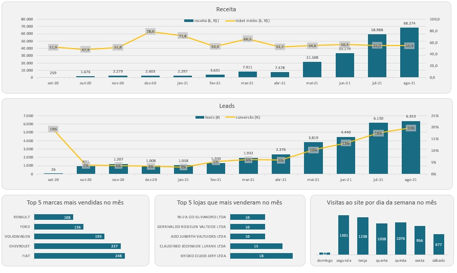

<h1>PROJETO DE ANÁLISE DE E-COMMERCE DE AUTOMÓVEIS</h1>

Projeto proposto no Curso de SQL de Midori Toyota (Agradeço muito pelos ensinamentos!!!)
<a href="https://www.udemy.com/course/sql-para-analise-de-dados/">Link para o curso!</a>

<h2>PROPOSTA DO PROJETO</h2>
    <ul>
        <li><h3>Objetivo principal:</h3>
            <ul><li>Criar um dashboard de vendas com os principais indicadores de desempenho e com os principais drivers dos resultados do mês.</li></ul>
        </li>
        <li><h3>Objetivos secundários:</h3>
            <ul>
            <li>Calcular Receita;</li>
            <li>Calcular Ticket médio;</li>
            <li>Calcular Leads;</li>
            <li>Calcular Taxa de conversão de Leads;</li>
            </ul>
        </li>
    </ul>
    
<h2>DADOS UTILIZADOS</h2>
    Foram utilizados dados fictícios fornecidos pela professora, os quais seguem a seguinte tabela relacional:
    

<h2>PARA SOLUÇÃO DO PROBLEMA FORAM USADOS</h2>
    PostGreSQL (pgAdmin 4)
    Microsoft Excel

Queries usadas podem ser consultadas neste mesmo repositório.
Arquivo contendo os resultados, queries e dashboard criados via Excel podem ser acessados tambem neste repositório.

<h2>CONCLUSÕES</h2>
    
    <ul>
        <li>A receita vêm crescendo mas não é um impacto do ticket médio pois nos últimos meses ele vem se estabilizando;</li>
        <li>O número de leads e a taxa de conversão seguem em uma crescente, portanto as estratégias de marketing estão funcionando e além de estarem trazendo mais leads para nosso site, a taxa de conversão também cresceu;</li>
        <li>A marca mais vendida no mês foi FIAT;</li>
        <li>A loja que mais vendeu no mês foi KIYOKO CLIEIDI JERY LTDA;</li>
        <li>O ínicio da semana é onde temos o maior volume de acessos e a medida que a semana se aproxima do final os acessos vão caindo também.</li>
    </ul>

<h2>Mais uma vez gostaria de agradecer a <a href="https://www.udemy.com/course/sql-para-analise-de-dados/">Midori Toyota</a> pelo curso. Me foi muito útil!!! Tambem gostaria de recomendar este curso para qualquer um pois a linguagem é muito prática e acessível, creio que é um ótimo ponto de partida para quem deseja iniciar os estudos em SQL e até mesmo em Excel.</h2>